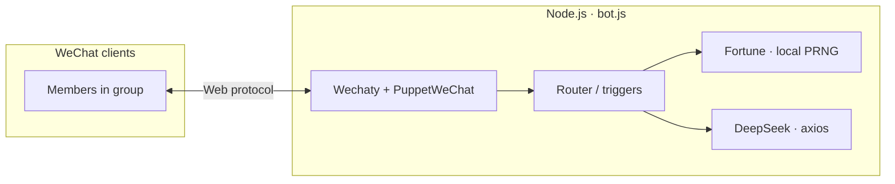

<div align="center">

# 微信群 AI 机器人 · WeChat Group AI Bot

**个人微信网页版 · Wechaty · DeepSeek · 今日运势**

[](https://nodejs.org/)
[](https://www.npmjs.com/)
[](https://github.com/wechaty/wechaty)
[](https://github.com/wechaty/wechaty-puppet-wechat)
[](https://www.deepseek.com/)
[](https://axios-http.com/)
[](https://github.com/motdotla/dotenv)

[]()
[]()
[]()
[]()

*群聊关键词 / @ 触发毒舌短评；@ +「今日运势」本地伪随机抽签。*  
*Group chat triggers snappy AI replies; @ + fortune keyword for seeded daily luck.*

</div>

---

## 目录 · Table of contents

| 🇨🇳 中文 | 🇺🇸 English |
|--------|-------------|
| [概述](#-概述--overview) | [Overview](#-概述--overview) |
| [功能](#-功能--features) | [Features](#-功能--features) |
| [架构](#-架构--architecture) | [Architecture](#-架构--architecture) |
| [目录结构](#-目录结构--project-layout) | [Project layout](#-目录结构--project-layout) |
| [快速开始](#-快速开始--quick-start) | [Quick start](#-快速开始--quick-start) |
| [环境变量](#-环境变量--environment) | [Environment](#-环境变量--environment) |
| [调试](#-调试--debugging) | [Debugging](#-调试--debugging) |
| [常见问题](#-常见问题--faq) | [FAQ](#-常见问题--faq) |
| [自定义](#-自定义--customization) | [Customization](#-自定义--customization) |
| [免责声明](#-免责声明--disclaimer) | [Disclaimer](#-免责声明--disclaimer) |

---

## 📌 概述 · Overview

**中文：** 本项目使用 **Wechaty + 网页微信 Puppet** 登录个人微信，在**群聊**中根据规则调用 **DeepSeek** 或使用内置词库回复。微信官方对网页版与自动化限制严格，**不保证长期可用**，仅供学习与技术验证。

**English:** This project uses **Wechaty** with the **web WeChat puppet** to sign in a personal account and reply in **group chats** via **DeepSeek** or a built-in fortune pool. Official WeChat policies are strict; **availability is not guaranteed**. For learning and experimentation only.

---

## ✨ 功能 · Features

| 标签 · Tags | 中文说明 | English |
|-------------|---------|---------|
| `AI` `deepseek` `群聊` | 群消息含 **`AI`** 或 **@机器人** → DeepSeek 毒舌短评，**最多 25 字**（硬截断） | Message contains **`AI`** or **mentions the bot** → DeepSeek reply, **max 25 chars** (hard truncate) |
| `运势` `伪随机` `无API` | **@机器人** 且含 **「今日运势」** → 四行固定格式；**用户名 + 本地日期** 种子 LCG，**同人同日相同** | **Mention bot** + **`今日运势`** → fixed 4-line format; **username + local date** seeded LCG, **same user same day = same result** |
| `safety` | 忽略机器人自己发的消息 | Ignores messages sent by the bot itself |
| `debug` | 控制台 `[message]` / `[今日运势]` 日志 | Console logs `[message]` / fortune events |

---

## 🏗 架构 · Architecture



---

## 📁 目录结构 · Project layout

```
wechatbot/
├── bot.js              # Entry · 入口
├── package.json
├── .env                # Secrets (gitignored) · 密钥勿提交
├── .env.example
└── README.md
```

---

## 🚀 快速开始 · Quick start

**中文**

1. 安装 [Node.js](https://nodejs.org/)（≥ 18）  
2. `cp .env.example .env`，填入 `API_KEY`（DeepSeek）  
3. `npm install` → `node bot.js`（或 `npm start`）  
4. 终端里的链接在浏览器打开，**扫码登录网页微信**

**English**

1. Install [Node.js](https://nodejs.org/) (≥ 18).  
2. Copy `.env.example` to `.env` and set `API_KEY` for DeepSeek.  
3. Run `npm install`, then `node bot.js` (or `npm start`).  
4. Open the printed URL in a browser and **scan to log in to web WeChat**.

---

## 🔐 环境变量 · Environment

| Variable | 中文 | English |
|----------|------|---------|
| `API_KEY` | DeepSeek API Key（[申请](https://platform.deepseek.com/)） | DeepSeek API key ([console](https://platform.deepseek.com/)) |

---

## 🛠 调试 · Debugging

**中文：** 需要弹出 Chromium 窗口时（看二维码/页面是否异常）：

```powershell
$env:WECHATY_PUPPET_WECHAT_PUPPETEER_HEAD="1"; node bot.js
```

**English:** To show the Chromium window (QR / page issues):

```powershell
$env:WECHATY_PUPPET_WECHAT_PUPPETEER_HEAD="1"; node bot.js
```

*(macOS / Linux: `export WECHATY_PUPPET_WECHAT_PUPPETEER_HEAD=1` then `node bot.js`.)*

---

## ❓ 常见问题 · FAQ

<details>
<summary><b>中文 · CN</b></summary>

| 现象 | 说明 |
|------|------|
| `starting puppet ... timeout` | Wechaty 默认约 15s 等待；冷启动慢时会出现 WARN，稍后若能扫码可先忽略 |
| `503` / `without a ready angular env` | 网页微信未进入预期页面，常见于策略或账号不可用网页版 |
| 无法扫码 / 被登出 | 微信风控，需按客户端指引申诉或等待；**无法靠改本仓库绕过** |

</details>

<details>
<summary><b>English · EN</b></summary>

| Symptom | Note |
|---------|------|
| `starting puppet ... timeout` | Wechaty waits ~15s for puppet start; slow cold start → WARN; if scan works later, often ignorable |
| `503` / `without a ready angular env` | Web WeChat didn’t load the expected app; policy or account restrictions |
| Scan blocked / logged out | Tencent risk control; follow in-app guidance. **Not fixable by editing this repo** |

</details>

---

## 🎨 自定义 · Customization

| 项目 · Item | 位置 · Where |
|-------------|--------------|
| AI 字数上限 · Max reply length | `MAX_REPLY_CHARS` + system prompt in `callDeepSeek` |
| 运势词库 · Fortune pools | `FORTUNE_POOL` in `bot.js` |

---

## ⚠️ 免责声明 · Disclaimer

**中文：** 使用网页协议与第三方自动化可能违反微信用户协议或触发风控。因使用本项目导致的**封号、限制登录、数据丢失**等后果，由使用者自行承担；仓库不提供任何担保。

**English:** Automating web WeChat may violate Tencent’s terms and trigger risk controls. **Account bans, login restrictions, or data loss** are your own responsibility; this repository is provided **as-is** without warranty.

---

<div align="center">

**Made with** · `Node.js` · `Wechaty` · `DeepSeek`

</div>
